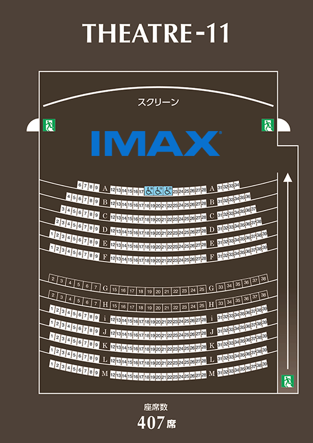

# 109 Cinemas Seat Sniper

A simple browser bookmark toolkit to help you automatically select [IMAX GT](https://en.wikipedia.org/wiki/IMAX) seats and purchase tickets on the 109 Cinemas Japan website.

---

## What is IMAX?

IMAX is a special type of high quality movie screen. There are two main types:

*   **IMAX with Laser (GT / "Grand Theatre"):** It features dual 4K laser projectors, a massive screen (up to 26 meters wide and 22 meters tall), 12-channel immersive audio, and a 1.43:1 aspect ratio that fills the viewer's peripheral vision.
*   **IMAX Digital / "LieMax":** Smaller screens placed inside normal theaters. They are good but much smaller than GT screens.

> [!TIP]
> If it is your first time watching a movie in IMAX GT, make sure to watch it in 3D to get the full visual effect of the giant screen.
---

## IMAX GT in Japan

There are only two IMAX GT theatres (capable of the full 1.43:1 aspect ratio) in Japan

1.  **[Osaka Expo City](https://109cinemas.net/osaka-expocity/)** (operated by 109 Cinemas)
2.  **[Grand Cinema Sunshine Ikebukuro](https://www.cinemasunshine.co.jp/theater/gdcs/)** (operated by Cinema Sunshine)

*Note: While these screens support the full 1.43:1 aspect ratio, they use digital projection (dual 4K laser) rather than the original 70mm film experience, as there are no active 70mm IMAX film theatres in Japan.*

### Best Seats for IMAX GT
The best seats are in the middle back rows: **Rows H to J, Seats 20 to 22** (the center), with **H-20** being the single best seat in this screen (which is also an Executive Seat). Here is why:

*   **Good View:** You can see the whole screen easily without hurting your neck.
*   **Centered:** You sit directly in the middle of the screen.
*   **Great Sound and Picture:** The curved screen is designed so these middle seats get the best experience.
*   **Avoid Extremes:** Seats too close (Rows A to D) will hurt your neck and make the picture look stretched. Seats too far back do not feel as exciting.



---

## Booking Tips

*   **Buy the Membership:** Purchase the 500 yen member card. It allows you to book seats early.
*   **Early Booking Window:** With the membership, seats open for booking 3 days before the show at 21:00 (9:00 PM).
*   **Premium Seats Included:** The 500 yen membership includes premium seats at no extra charge, saving you from paying the usual upgrade fees.

---

## The Bookmarklets

### Bookmarklet 1: Close the Popup
This script automatically clicks the "Next" button on the pop up window that appears before you can select seats. **Run this first.**

```javascript
javascript:(function(){const loop=setInterval(()=>{const popup=document.querySelector('a[href="javascript:nextPopupAction();"]');if(popup)popup.click();},20);setTimeout(()=>{clearInterval(loop);},1300);})();
```

### Bookmarklet 2: Select Seats & Buy
This script selects seats `H-020` and `H-021` and immediately clicks the buy button. **Run this second.**

```javascript
javascript:(function(){var t=["H -020","H -021"];t.forEach(function(v){var c=document.querySelector('input.seat[value="'+v+'"]');if(c&&!c.checked)c.click();});setTimeout(function(){document.getElementById('resv-purchase').click();},300);})();
```

*Note: You can change the seat numbers in the code (the `["H -020","H -021"]` part) to pick different seats.*

---

## How to Install Bookmarklets

1.  Show your browser bookmarks bar:
    *   **Windows/Linux:** Press `Ctrl + Shift + B`
    *   **Mac:** Press `Cmd + Shift + B`
2.  Right click on your bookmarks bar and click **Add Page** or **New Bookmark**.
3.  Paste the **Close the Popup** script into the **URL** box and name it `pop`.
4.  Create another bookmark, paste the **Select Seats & Buy** script into the **URL** box, and name it `snipe`.

---

## How to Use (Step-by-Step Tutorial)

Once you have installed both bookmarklets (`pop` and `snipe`), follow these steps to secure your seats:

### Step 1: Prepare your URL
The seat selection page uses a static link format. You do not need to navigate through the website's main pages when bookings open. You can set the link for your preferred cinema screen, schedule, and date beforehand:
```
https://cinema.109cinemas.net/cgi-bin/pc/resv/resv_shw_ppt.cgi?wovn=en&ttc=50733&tsc=1170&tssc=17011&ymd=YYYY-MM-DD&cs=8
```
Change the `ymd` parameter (e.g., `ymd=2026-05-31`) to your target date.

*   `ttc`: Cinema location code.
*   `tsc`: Screen code.
*   `tssc`: Show time code.
*   `cs=8`: Site ID.

### Step 2: Open and Refresh the Page
Open this prepared link in your web browser. 
*   **Booking Tip:** Instead of clicking through the website menus, stay on this URL. If you have the 500 yen membership, refresh the page exactly **3 seconds before 21:00 (9:00 PM)** 3 days before the show. This ensures you bypass all navigation delays and load the seat map immediately when the booking window opens.

### Step 3: Close the Popup
When the page loads, 109 Cinemas displays a terms-of-service popup before you can see the seat map.
*   Click the **pop** bookmarklet from your bookmarks bar.
*   This automatically clicks the "Next" button and closes the popup immediately.

### Step 4: Select and Buy Seats
Once the seat map is visible:
*   Click the **snipe** bookmarklet from your bookmarks bar.
*   The script will automatically check the seats specified in your script (defaults to H-020 and H-021) and click the purchase button.
*   You will be redirected straight to the payment/checkout screen, securing your selected seats.

---

## Disclaimer

This is a personal helper tool. Please use it responsibly and follow the terms of service of 109 Cinemas.